# Memesis Architecture

Status: architecture decision for the first proof  
Audit date: 2026-09-29  
Scope: the question “Is AI infrastructure shifting toward smaller/specialized models, and which actors and companies are driving that shift?”

## Executive decision

Build Memesis as a provenance-first investigation system, not as a general knowledge graph or a social-listening platform.

The first version is one Python application, one PostgreSQL database, one background worker, and one small React visualization. It collects a bounded corpus, stores immutable source versions, extracts atomic beliefs and company actions once, projects them into a typed temporal graph, computes deterministic scores, retrieves a small evidence-bearing subgraph, and uses one final model call to draft an answer with citations.

The system of record is relational. The graph is a typed projection stored in ordinary PostgreSQL node and edge tables and queried with recursive SQL. PostgreSQL full-text search is the retrieval baseline. `pgvector` is optional only after a lexical-retrieval evaluation demonstrates a material miss rate.

No Neo4j, FalkorDB, Elasticsearch, Redis, Kafka, Celery, Kubernetes, separate vector database, or generic GraphRAG framework is required to prove the thesis.

## Product boundary

Memesis v0 answers one bounded market question by showing:

- the atomic beliefs present in the corpus;
- the people and companies expressing or amplifying them;
- the source-independent propagation path, with copied and syndicated material discounted;
- observable company actions plausibly connected to those beliefs;
- adjacent markets and dependencies supported by evidence;
- the difference between publication time, observation time, and inferred validity time;
- the evidence for, against, and qualifying each conclusion;
- what a named company should investigate next.

It does not claim to discover the true origin of a belief, prove causality from content to market outcome, monitor the whole internet, infer private beliefs, or predict markets from a thin historical sample.

## Architecture invariants

1. **Collect once.** A source response is content-addressed and versioned. An unchanged hash is not fetched into a new downstream pipeline.
2. **Normalize once.** Normalized text is immutable for a `(document_version, normalizer_version)` pair.
3. **Extract once.** Extraction is cached by document hash, selected spans, ontology version, prompt version, and model identifier.
4. **Evidence before graph.** No node, edge, score, or prose claim exists without one or more exact evidence spans or an explicit `derived` basis.
5. **Append, do not overwrite.** Corrections, deletions, merges, and changed facts create new versions or tombstones.
6. **Separate clocks.** Publication/occurrence time, source observation time, and system record time are never collapsed.
7. **Models propose; code validates.** LLM output is a typed proposal. Deterministic validation and conservative resolution decide what becomes active.
8. **Scores are decomposable.** Every score exposes its inputs, weights, coverage, and calculation version. Influence is market-specific and time-specific.
9. **Absence is not evidence.** Missing sources lower coverage; they do not become negative evidence.
10. **Reason over a packet.** The final model sees a small, balanced evidence packet, never the full corpus.

## System shape

```mermaid
flowchart LR
    S[Source adapters] --> R[Immutable source versions]
    R --> N[Deterministic normalization]
    N --> F[Relevance filter and span selection]
    F --> X[Typed extraction]
    X --> V[Validation and entity resolution]
    V --> G[Canonical nodes, edges, events]
    G --> C[Deterministic scoring]
    G --> Q[Bounded subgraph retrieval]
    C --> Q
    Q --> P[Evidence packet]
    P --> A[Reasoning model]
    A --> U[API and investigation UI]
    R --> P
```



The application has four internal modules rather than independently deployed services:

- `ingest`: source policy, adapters, cursors, raw versions, normalization;
- `knowledge`: extraction, assertions, entity resolution, graph projection;
- `analysis`: scoring, retrieval, evidence-packet construction, synthesis;
- `app`: HTTP API, review workflow, and visualization.

They share one database but have explicit interfaces so a module can later become a service without changing the data contract.

## A. Ingestion architecture

### First-slice source set

Use a deliberately bounded and diverse corpus:

| Source | Access path | Purpose | First-slice rule |
|---|---|---|---|
| Company and lab blogs, model cards, product docs, pricing pages | HTTP plus Trafilatura; Crawl4AI-compatible fallback interface | Direct company action and positioning evidence | Seeded domains only; robots and source policy checked before fetch |
| OpenAlex | REST API | Papers, authors, institutions, citations, topics | Metadata and abstracts first; no bulk PDF download |
| Bluesky | Public AppView search for discovery; Jetstream v2 for filtered live updates | Actor statements and amplification events | Posts only; filtered by seed DIDs and query terms; process deletes/account markers |
| Hacker News | Official Algolia API | Practitioner discussion and early amplification | Search bounded terms and date windows |
| GitHub | Official REST/GraphQL API and release feeds | Product releases, repository activity, organization evidence | Named organizations/repositories only; store release/metadata, not a global event stream |
| RSS/Atom | Feed URLs from the source registry | Incremental updates from known publishers | Conditional GET and entry identity required |
| Manual evidence import | URL or reviewed JSON/CSV | High-value sources unavailable through an API | Same provenance and validation rules as automated sources |

Reddit, YouTube, X, LinkedIn, and gated newsletters are not required for the proof. They remain adapter slots. X is excluded from the baseline because access and cost are enrollment-dependent; LinkedIn and unofficial session-cookie collectors are excluded because their operational and terms risk exceeds their value for this proof.

### Collection contract

Every adapter emits the same envelope:

```text
source_key              stable adapter-specific identifier
external_id             stable source record identifier
canonical_url
retrieved_at
published_at?           source-declared timestamp
updated_at?             source-declared timestamp
author_identifiers[]    DID, ORCID, GitHub login, URL, etc.
content_type
raw_payload
http_status / etag / last_modified?
cursor_after?
rights_policy_id
deletion_state
```

The worker writes the document version and its content hash in the same transaction that advances the source cursor. A cursor never advances ahead of durable content. Jobs are idempotent on `(source_id, external_id, source_version_or_hash)`.

### Scheduling and work queue

Use a PostgreSQL `job` table with `SELECT … FOR UPDATE SKIP LOCKED`. A cron trigger enqueues due collections. This is sufficient for a single worker and supports retries, leases, dead-letter state, and replay without Redis or a separate queue.

Collection frequency for the proof:

- known blogs/RSS/GitHub releases: every 6–24 hours;
- OpenAlex queries: daily during the investigation, then weekly;
- Jetstream live consumer: optional long-running process after the historical seed is complete;
- manual sources: on demand.

### Source governance

Each source has a policy row recording access method, terms URL and review date, robots behavior, allowed fields, retention, redistribution, deletion handling, and rate budget. The adapter refuses to run when the policy is absent or expired. Anti-bot bypass, credential reuse, and proxy rotation are not default capabilities.

## B. Canonical data model

The canonical model has four layers.

### 1. Source ledger

- `source` and `source_policy`
- `collection_run` and `collection_cursor`
- `document` and immutable `document_version`
- `normalized_document` and addressable `evidence_span`

### 2. Knowledge ledger

- typed `entity` rows for Person, Company, Market, and Product;
- `belief`, `content`, and `event` rows;
- `assertion` rows containing the extractor proposal, stance, confidence, exact span IDs, and review state;
- `graph_edge` plus `edge_evidence`;
- aliases, external identifiers, merge decisions, and tombstones.

### 3. Analysis ledger

- `investigation` and its corpus/query specification;
- `score_snapshot` with inputs and algorithm version;
- `retrieval_run`, selected node/edge IDs, rejected candidates, and coverage report;
- `reasoning_run`, prompt hash, model, token counts, cost, answer, and cited evidence IDs.

### 4. Operations ledger

- `job`, `model_call`, `review_task`, and structured run events.

The source ledger is immutable evidence. The knowledge ledger is revisable interpretation. The analysis ledger is reproducible computation. These are never merged into one opaque JSON blob.

## C. Graph ontology

Use the seven requested node types and fifteen requested edge types. Add only `PARTICIPATED_IN`, because otherwise Event nodes cannot be connected to the people, companies, products, or markets involved in an action or outcome. The exact contracts are in [ONTOLOGY.md](./ONTOLOGY.md).

An edge is an assertion with:

- direction and allowed endpoint types;
- valid-time interval and recorded-time interval;
- source/evidence span IDs;
- assertion method (`source_explicit`, `extracted`, `deterministic`, `analyst`);
- confidence and review state;
- algorithm/model version when derived.

`PRECEDES` means temporal order, not causation. `INFLUENCES` is created only from an explicit attributable claim or a versioned scoring rule and is always marked as asserted or derived. `ACTS_ON` requires an observable company action event; rhetoric alone is insufficient.

## D. Storage architecture

### First slice

Use PostgreSQL 17+ as the sole durable service:

- ordinary tables for canonical records and adjacency-list edges;
- `jsonb` for source-specific fields, never for core identifiers or timestamps;
- `tsvector` and GIN indexes for lexical retrieval;
- trigram indexes for candidate name matching;
- recursive CTEs for bounded graph traversal;
- range types or explicit columns for validity and transaction intervals;
- native TOAST storage for the small raw corpus.

Do not introduce an object store until raw payloads exceed an agreed database threshold (for example, 20 GB) or include large binaries. Do not store PDFs in the proof. Do not introduce `pgvector` until a retrieval evaluation shows that full-text plus graph expansion misses relevant evidence.

### Why not a graph database now

The proof has thousands, not billions, of nodes and edges. Its difficult problems are evidence semantics, identity, independence, temporal correctness, and calibration—not graph traversal throughput. A second database would add deployment, backup, migration, consistency, and license burden before it adds product evidence.

### Migration trigger

Evaluate a specialized graph store only when measured queries exceed the latency target after indexing and SQL tuning, or when the active graph exceeds roughly tens of millions of edges and multi-hop queries become a dominant workload. Keep the graph access interface store-agnostic so this is a migration, not a rewrite.

## E. Entity resolution

Resolution is conservative and reversible.

1. **Deterministic identity:** exact DID, ORCID, OpenAlex ID, DOI, company domain, GitHub organization ID, or canonical product URL.
2. **Normalized aliases:** Unicode normalization, case folding, punctuation/title removal, known alias table, and domain-aware name rules.
3. **Candidate generation:** trigram similarity plus shared organization, co-author, domain, market, and identifier context.
4. **Scoring:** a transparent weighted feature vector. A model may explain a candidate pair but cannot authorize a merge.
5. **Decision:** auto-link only on an exact stable identifier or two strong independent signals above a calibrated threshold; otherwise create a review task.
6. **Merge ledger:** record survivor, absorbed ID, evidence, decision author, timestamp, and reversible supersession.

Belief resolution is separate from entity resolution. Two passages share a Belief only when their normalized proposition, scope, subject, modality, and time horizon match. Embedding similarity is candidate generation, not proof of equivalence.

## F. Extraction pipeline

```text
immutable document version
→ deterministic cleaning and language/date/URL parsing
→ paragraph and sentence spans with stable offsets
→ deterministic relevance filter
→ one structured extraction call over only relevant span packs
→ schema and exact-quote validation
→ identifier linking and conservative resolution
→ assertions under review state
→ graph projection
```

### Deterministic first

Use parsers for metadata, links, author handles, citations, quotes, dates, prices, model names, GitHub releases, and OpenAlex identifiers. Detect exact duplicates by hash and near-duplicates with MinHash/SimHash. Detect syndication by canonical URL, link graph, publication order, and high shingle overlap.

### Model call

The extraction model receives only relevant spans with stable IDs. It returns typed proposals for:

- atomic beliefs and stance (`supports`, `opposes`, `qualifies`, `mentions`);
- people, companies, products, and markets;
- observable events and company actions;
- candidate ontology edges;
- exact supporting span IDs and calibrated confidence.

Reject an extracted assertion if its quoted span is not an exact substring, its endpoint types violate the ontology, its dates are incoherent, or it lacks evidence. Store the raw model response and all validation errors.

Use provider aliases—`extract_small`, `resolve_small`, `reason_strong`—mapped through an internal interface. No domain code imports a provider SDK directly.

## G. Retrieval

Retrieval is investigation-specific, not a general chat index.

1. Parse a question into a reviewed investigation specification: markets, proposition, time window, source families, seed actors/companies, and inclusion/exclusion terms.
2. Retrieve candidate Beliefs using full-text search and exact aliases.
3. Expand at most two graph hops through `EXPRESSES`, `PUBLISHED`, `BELIEVES`, `AMPLIFIES`, `ACTS_ON`, `BUILDS`, `SERVES`, `PRECEDES`, and `PARTICIPATED_IN`.
4. Rank edges by market relevance, time fit, evidence quality, source independence, and review state.
5. Enforce diversity caps by source family, organization, actor, and stance.
6. Build a packet capped by evidence count and tokens—for example, 30–50 exact spans, 20–40 graph edges, and 12,000 input tokens.
7. Include the strongest counterevidence, unresolved conflicts, missing-source report, and score decomposition.

The retrieval result contains IDs and exact spans. The final model cannot cite a URL it did not receive.

## H. Scoring

Scores support prioritization; they are not truth or causal proof.

The implemented six-score v0 contract, formulas, time rules, decomposition, and limits
are specified in [PHASE4_DETERMINISTIC_SCORES.md](./PHASE4_DETERMINISTIC_SCORES.md).
It supersedes the earlier illustrative formulas below for the current implementation.
Those formulas remain design candidates for later calibrated, market-specific scoring.

### Actor influence in market

For actor `a`, market `m`, and time window `t`:

```text
Influence = coverage_confidence × 100 ×
  (0.25 market_relevance
 + 0.20 lead/originality
 + 0.20 independence_adjusted_amplification
 + 0.20 company_action_conversion
 + 0.15 historical_outcome_signal)
```

When history is absent, omit the historical component and renormalize the remaining weights; do not silently score it zero. Report sample size, channels observed, and confidence beside the score.

### Belief propagation

```text
Propagation = 100 ×
  (0.30 velocity
 + 0.25 independent_actor_reach
 + 0.20 cross_channel_breadth
 + 0.15 persistence
 + 0.10 action_uptake)
```

Counts are clustered by common origin so fifty syndicated copies do not equal fifty independent confirmations. Each component uses a declared time window and log/percentile normalization to prevent one viral account from dominating.

### Precursor signal

For the proof, report descriptive lead time and lift only:

- first observed belief acceleration;
- first observable company action;
- first defined market outcome;
- lag distribution across comparable episodes;
- baseline-adjusted frequency with uncertainty.

Do not produce a “predictive” score until there are enough pre-registered historical cases and out-of-sample evaluation.

### Market adjacency

Rank market pairs from shared products, serving companies, explicit dependencies, and co-occurring reviewed beliefs. Keep every contribution visible. Analyst-confirmed `ADJACENT_TO` and directional `DEPENDS_ON` edges remain distinct from a similarity score.

## I. Reasoning layer

The reasoning layer performs one job: turn an evidence packet into a decision-oriented memo.

The prompt requires:

- a direct answer with calibrated language;
- actor and company rankings with score components;
- evidence for and against the shift;
- belief → propagation → action → outcome timelines;
- alternative explanations and coverage gaps;
- concrete investigation recommendations for a named company;
- citations using internal evidence IDs only.

A deterministic post-check rejects uncited factual sentences, unknown evidence IDs, unsupported numeric claims, or conclusions that exceed the packet’s stated confidence. The answer is stored with the exact packet hash and model configuration.

## J. API

Use FastAPI with generated OpenAPI. First-slice endpoints are read-heavy:

```text
POST /investigations
POST /investigations/{id}/collect
POST /investigations/{id}/extract
POST /investigations/{id}/analyze
GET  /investigations/{id}
GET  /investigations/{id}/answer
GET  /investigations/{id}/graph
GET  /beliefs/{id}
GET  /actors/{id}/influence
GET  /companies/{id}/actions
GET  /evidence/{id}
GET  /review-tasks
POST /review-tasks/{id}/decision
GET  /runs/{id}
```

Mutation endpoints require idempotency keys. Responses expose provenance, version, and coverage fields. There is no generic arbitrary-Cypher or unrestricted SQL endpoint.

## K. Frontend visualization

Use React, TypeScript, and Cytoscape.js. The proof needs three coordinated views:

1. **Evidence timeline:** belief appearances, amplification, company actions, and outcomes on one temporal axis.
2. **Market graph:** filtered Person/Company/Belief/Product/Market/Content/Event subgraph; no attempt to render the whole database.
3. **Evidence drawer:** exact passage, source, dates, stance, extraction method, confidence, and source-dependence cluster.

Every score is expandable into components. Every edge is clickable to evidence. The UI labels inferred, derived, analyst-reviewed, and source-explicit assertions differently. The graph defaults to a question-specific subgraph with hard node/edge limits to avoid “hairball” visualization.

## L. Observability

Start with structured JSON logs, database run records, and a Prometheus-compatible metrics endpoint. Add OpenTelemetry exporters only when there is an external collector.

Required measures:

- collection latency, errors, retries, rate-limit headers, bytes, and cursor lag;
- new/unchanged/updated/deleted document counts;
- normalization and extraction cache-hit rates;
- extraction tokens, latency, cost, schema failures, and evidence-span failures;
- unresolved entity/belief candidates and reviewer agreement;
- nodes/edges/assertions created, superseded, or rejected;
- retrieval precision/recall on the gold set, packet size, and source diversity;
- score version and coverage distribution;
- end-to-end freshness and cost per accepted assertion.

Never log raw credentials or full private-source payloads.

## M. Testing

The minimum test pyramid is:

- unit tests for normalization, hashing, timestamp rules, score components, and ontology constraints;
- recorded contract fixtures for every source adapter; no live network in default CI;
- golden extraction fixtures with exact span offsets and expected accepted/rejected assertions;
- entity-resolution pairs covering aliases, collisions, and non-merges;
- property tests for idempotency, temporal intervals, cursor monotonicity, and deletion folding;
- PostgreSQL integration tests for migrations, recursive retrieval, full-text search, and job leasing;
- provenance round-trip: answer citation → assertion → edge/node → evidence span → immutable document version;
- cost-cap tests that fail when a fixture run exceeds expected model calls or tokens;
- one browser test for the vertical-slice investigation.

Live-source smoke tests run manually or on a separately authorized schedule and never gate ordinary CI.

## N. Deployment

### Local development

Docker Compose runs:

- PostgreSQL;
- one application image exposing API and UI;
- one worker process from the same image.

Cron may run on the host or as a lightweight scheduler process. Model credentials are environment/secret-store values, never database content.

### First hosted deployment

- one small container service for API/UI;
- one small worker service, allowed to scale to zero between jobs;
- managed PostgreSQL with daily backups and point-in-time recovery;
- HTTPS reverse proxy;
- optional local volume or object storage only when raw binary evidence is introduced.

No Kubernetes. No always-on GPU. Browser crawling, if later approved, runs in an isolated worker with egress policy and resource limits.

### Recovery

The immutable source ledger and migrations are authoritative. Rebuild normalized text, graph projections, scores, and retrieval indexes from versioned inputs. Back up the database and test restoration. Model outputs are retained as auditable inputs, not regenerated during routine recovery.

## Vertical-slice proof protocol

The first investigation should be frozen before collection:

- proposition: AI infrastructure is shifting toward smaller and/or specialized models;
- time window: a reviewed historical range, initially 2023–2026;
- market scope: model providers, inference infrastructure, model tooling, enterprise deployments, and edge/on-device AI;
- operational definitions for “smaller,” “specialized,” “shift,” “driving,” “company action,” and “outcome”;
- explicit sources and known blind spots;
- target deliverable and evidence threshold.

Success is not a polished answer alone. The proof passes when a reviewer can trace each material conclusion to exact evidence, reproduce rankings from stored inputs, see counterevidence and source dependence, and rerun the investigation without reprocessing unchanged documents.

## What stays proprietary

- ontology semantics and validation rules;
- the historical market graph and evidence ledger;
- entity and belief resolution decisions;
- source-independence and propagation methods;
- market-specific actor influence scoring;
- belief → action → outcome linkage and calibration;
- market adjacency/dependency graph;
- retrieval packet construction and decision methodology;
- accumulated reviewed evidence and outcomes.

Collection transports, HTML extraction, database operation, API serving, and graph rendering remain commodity dependencies behind narrow interfaces.
